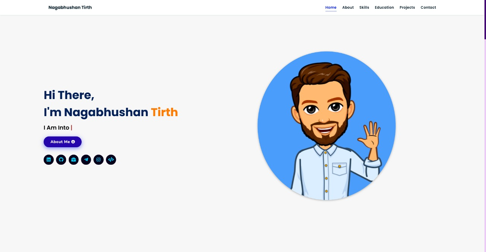

# 💼 Personal Portfolio Website

A clean and responsive **Portfolio Website** built using **HTML**, **CSS**, **JavaScript**, and **jQuery**. This portfolio showcases my personal details, resume, skills, projects, and contact information in a modern, user-friendly design.

## 🌐 Live Demo

[🔗 View Live](https://your-portfolio-demo-link.com)

## 📸 Screenshots

---

## 📁 Features

- 🎓 **About Me**: Brief introduction with education background.
- 💼 **Projects**: List of major personal & academic projects with links and descriptions.
- 🧠 **Skills**: Frontend, Backend & Tools section.
- 📄 **Resume**: Downloadable resume link.
- 📞 **Contact Form**: Simple form to reach out via email.
- 🎨 Fully responsive layout for mobile, tablet & desktop.
- 💡 Smooth scrolling and interactive animations with jQuery.

---

## 🚀 Technologies Used

- **HTML5**
- **CSS3**
- **JavaScript (ES6)**
- **jQuery**

---

## 📞 Contact

- 📧 Email: tirthnagbhushan@gmail.com
- 🔗 LinkedIn: [linkedin.com/in/your-profile](https://www.linkedin.com/in/nagbhushan-tirth-887865229/)
- 🐱 GitHub: [github.com/your-username](https://github.com/nt56)
- 📍 Location: Pune, Maharashtra
